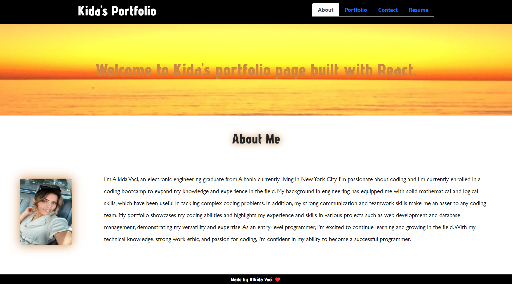
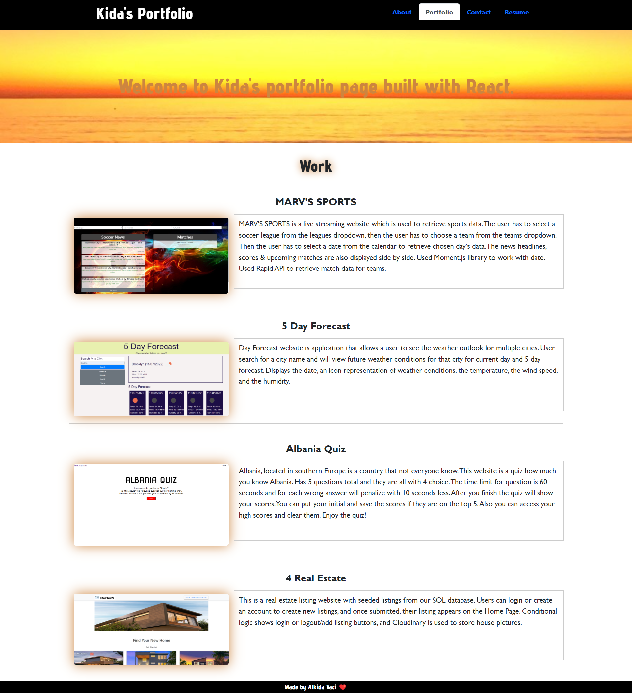
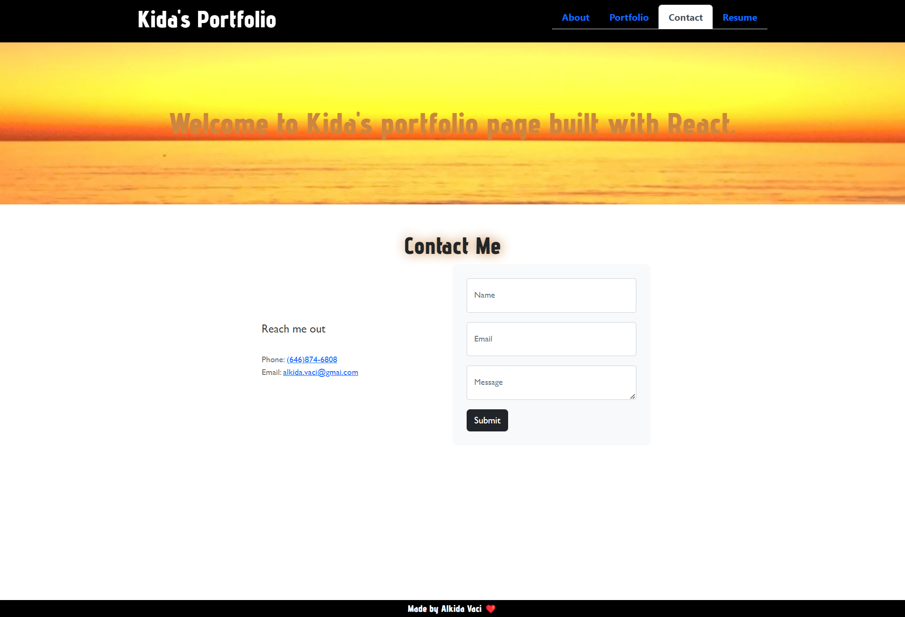
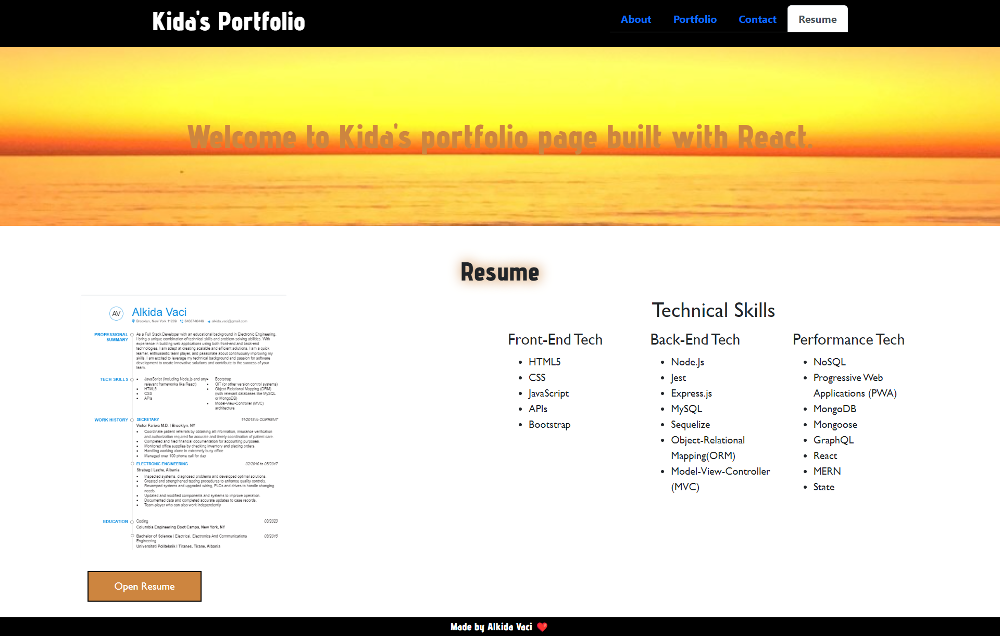

# Portfolio React
   
  ## Table of Contents
  - [Description](#description)  
  - [Usage](#usage)
  - [Contributing](#contributing)
  - [Questions](#Questions)
  

  ## Description
  🔍 As a web developer, I understand the importance of being part of a community. I've created a React portfolio that showcases my skills, experience, and projects. You will be able to read about me, take a look on my bootcamp projects, contact me and a link to my resume.

  
  ## Usage
  💻  About
    

  
  💻  Portfolio
    

  💻  Contact
    

  💻  Resume                                    
     
 

  💻 Navigate to [Kida's Portfolio](https://alkidavaci.github.io/portfolio-react/) to view the web page 
    
    

  ## License 
  
    
     
  ## Questions
  ✋ Feel free to contact me for any questions: 
  
  ✉️ Email me with any questions: [alkida.vaci@gmail.com](alkida.vaci@gmail.com) 
  :octocat: Find me on GitHub: [alkidavaci](https://github.com/alkidavaci)